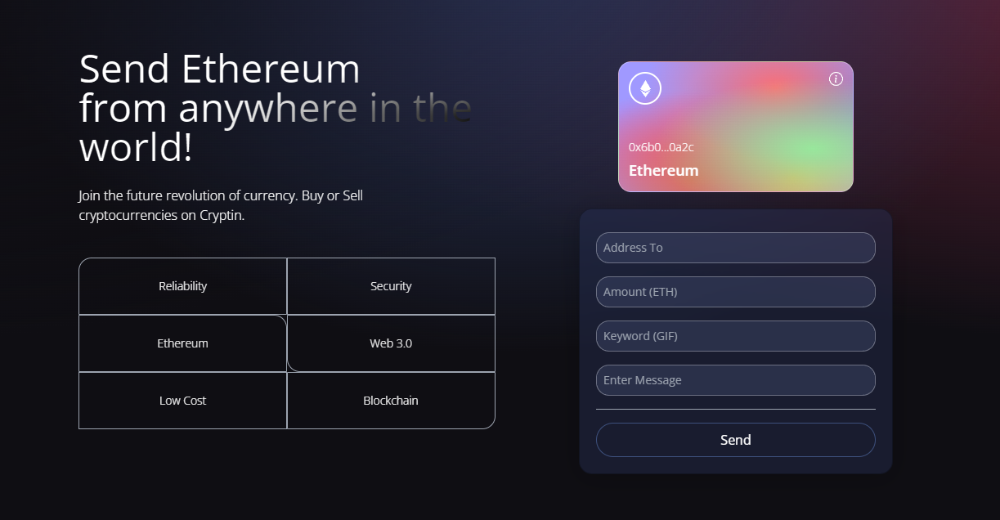
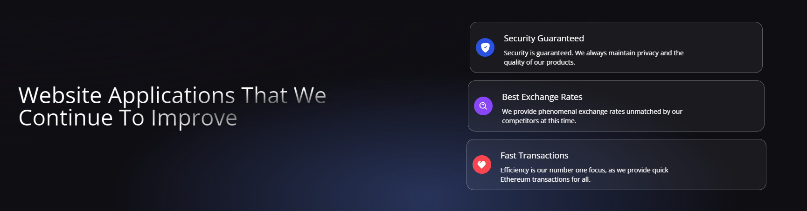
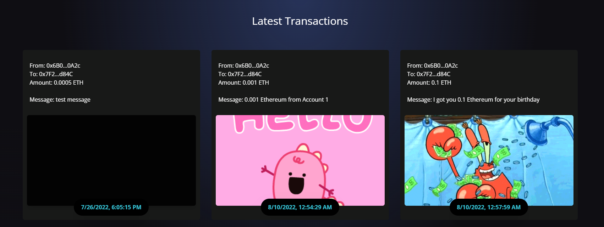

# Web 3.0 Cryptocurrency Blockchain Application

This website application, utilizing Web 3.0, allows users to send or receive the popular cryptocurrency known as Ethereum. Using the MetaMask google extension application, you can connect your cryptocurrency wallet to the website and send Ethereum to a particular individual through their account address. Along with their hexidecimal wallet address and entering the amount you want to give, you can additionally enter a message and a word that will be translated into a GIF. The website, as long as your MetaMask wallet is connected, allows you to see all of your transactions and its corresponding information, such as the GIF and the amount of Ethereum sent. When a transaction is made, it obtains the smart contract between the provider and signer, which is then sent to the blockchain accordingly.

I was able to create this applicaiton specifically through the use of JavaScript and Solidity. To run this application, enter the client folder by running "cd client" and then run the command "npm run dev".

# References
Adrian Hajdin (https://www.youtube.com/c/JavaScriptMastery)
